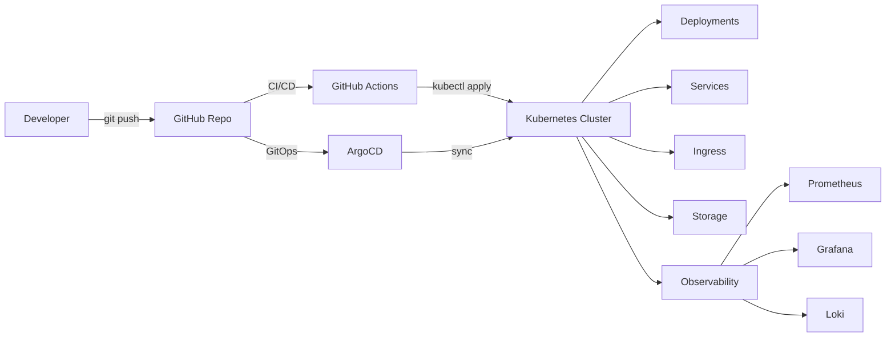

# Kubernetes Hands-On Labs

## 📌 Sobre o projeto

Este repositório reúne uma série de laboratórios práticos focados em Kubernetes, cobrindo desde conceitos fundamentais até cenários mais avançados utilizados em ambientes de produção.

O objetivo é demonstrar, de forma prática, a criação, operação e troubleshooting de aplicações containerizadas em Kubernetes, incluindo automação de deploy e GitOps.

---

## 🚀 Tecnologias utilizadas

* Kubernetes (kind)
* Docker
* Helm (básico e avançado)
* Prometheus
* Grafana
* Loki
* Traefik
* GitHub Actions
* ArgoCD

---

## 📚 Labs incluídos

### 🔹 Fundamentos

* Deployments
* Services
* ConfigMaps
* Secrets

### 🔹 Segurança

* RBAC (Role-Based Access Control)
* NetworkPolicy

### 🔹 Observabilidade

* Prometheus
* Grafana
* Loki

### 🔹 Escalabilidade

* HPA (Horizontal Pod Autoscaler)

### 🔹 Rede

* Ingress com Traefik

### 🔹 Persistência

* PVC / StorageClass
* StatefulSet

### 🔹 Empacotamento e Deploy

* Helm (básico e avançado)

### 🔹 Automação

* CI/CD com GitHub Actions
* GitOps com ArgoCD

---

## 🧠 Conceitos abordados

* Orquestração de containers
* Service discovery
* Observabilidade e logs
* Segurança de rede e controle de acesso (RBAC)
* Escalonamento automático
* Persistência de dados
* Gerenciamento de pacotes com Helm
* Deploy contínuo
* GitOps

---

## 🏗️ Arquitetura geral



---

## 🎯 Objetivo

Este projeto tem como foco:

* Consolidar conhecimentos práticos em Kubernetes
* Simular cenários reais de produção
* Demonstrar capacidade de troubleshooting
* Servir como portfólio técnico

---

## 📈 Diferenciais

* Abordagem prática (hands-on)
* Troubleshooting real documentado
* Uso de ferramentas modernas (GitOps, Observabilidade)
* Pipeline completo: desenvolvimento → deploy → operação
* Cobertura de temas avançados como Helm e RBAC

---

## ▶️ Como usar

1. Clonar o repositório:

```bash
git clone https://github.com/marsselu/kubernetes-hands-on-labs.git
cd kubernetes-hands-on-labs
```

2. Navegar pelos labs:

```bash
cd labs/<nome-do-lab>
```

3. Seguir o README de cada lab

---

## 📌 Observações

* Ambiente baseado em **kind (cluster local)**
* Alguns comportamentos podem variar em cloud providers
* Labs focados em aprendizado progressivo

---

## 👨‍💻 Autor

Marcelo Santos

---

## 📎 Conclusão

Este repositório demonstra a construção de um ambiente Kubernetes completo, desde a criação de workloads até automação com CI/CD e GitOps, refletindo práticas utilizadas em ambientes reais de produção.

---

