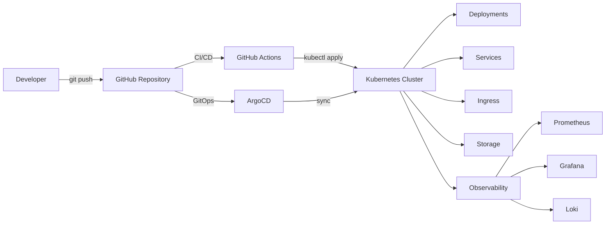

# Kubernetes Hands-On Labs

## 📌 About the Project

This repository contains a collection of hands-on Kubernetes labs, covering topics from fundamental concepts to advanced production-like scenarios.

The goal is to demonstrate practical experience in deploying, operating, and troubleshooting containerized applications in Kubernetes, including automation with CI/CD and GitOps.

---

## 🚀 Technologies Used

* Kubernetes (kind)
* Docker
* Helm (basic and advanced)
* Prometheus
* Grafana
* Loki
* Traefik
* GitHub Actions
* ArgoCD

---

## 📚 Labs Included

### 🔹 Core Concepts

* Deployments
* Services
* ConfigMaps
* Secrets

### 🔹 Security

* RBAC (Role-Based Access Control)
* NetworkPolicy

### 🔹 Observability

* Prometheus
* Grafana
* Loki

### 🔹 Scalability

* HPA (Horizontal Pod Autoscaler)

### 🔹 Networking

* Ingress with Traefik

### 🔹 Storage

* PVC / StorageClass
* StatefulSet

### 🔹 Packaging & Deployment

* Helm (basic and advanced)

### 🔹 Automation

* CI/CD with GitHub Actions
* GitOps with ArgoCD

---

## 🔑 Key Skills Demonstrated

* Kubernetes cluster management
* Application deployment and scaling
* Observability and logging
* Networking and service discovery
* Security (RBAC, NetworkPolicy)
* Persistent storage management
* CI/CD pipeline implementation
* GitOps workflows with ArgoCD

---

## 🏗️ Architecture Overview



---

## 🎯 Purpose

This project aims to:

* Build practical Kubernetes skills
* Simulate real-world production scenarios
* Demonstrate troubleshooting capabilities
* Serve as a technical portfolio

---

## 📈 Highlights

* Hands-on approach (not just theory)
* Real troubleshooting scenarios documented
* Modern stack (GitOps, Observability, CI/CD)
* End-to-end pipeline: development → deployment → operations
* Coverage of advanced topics like Helm and RBAC

---

## ▶️ How to Use

1. Clone the repository:

```bash
git clone https://github.com/marsselu/kubernetes-hands-on-labs.git
cd kubernetes-hands-on-labs
```

2. Navigate to a lab:

```bash
cd labs/<lab-name>
```

3. Follow the instructions in each lab README

---

## 📌 Notes

* Environment based on **kind (local Kubernetes cluster)**
* Some behaviors may differ in cloud environments
* Labs are designed for progressive learning

---

## 👨‍💻 Author

Marcelo Santos

---

## 📎 Conclusion

This repository demonstrates a complete Kubernetes workflow, from deploying applications to implementing CI/CD and GitOps practices, reflecting real-world production environments.

---
